# YouTube Spam Comment Buster

#### Language

| [English](README.md) | Indonesian |
|-|-|

Memblokir komentar YouTube yang mengandung karakter spesial yang dianggap spam (terutama spam komentar judi online) menggunakan Google Apps Script.

## Instalasi

1. Buka [Google Apps Script](https://script.google.com/home)

2. Buat project baru.

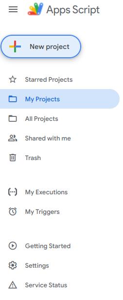

3. Ubah nama (terserah)

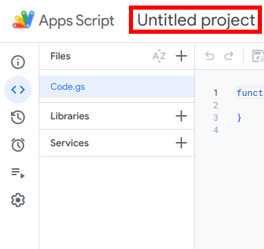

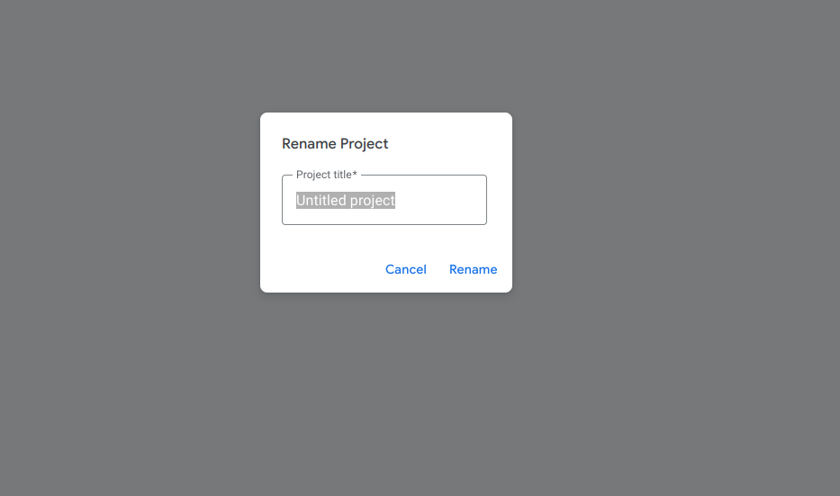

4. Pada bagian layanan, klik Tambahkan (+), kemudian scroll kebawah, kemudian pilih `YouTube Data API v3`.

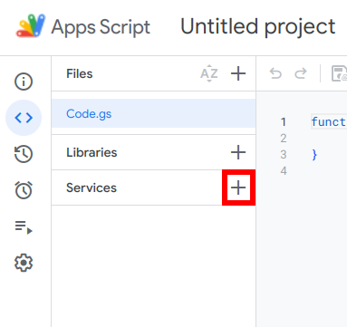

5. Ganti ID menjadi `YouTube` lalu klik "Tambahkan"

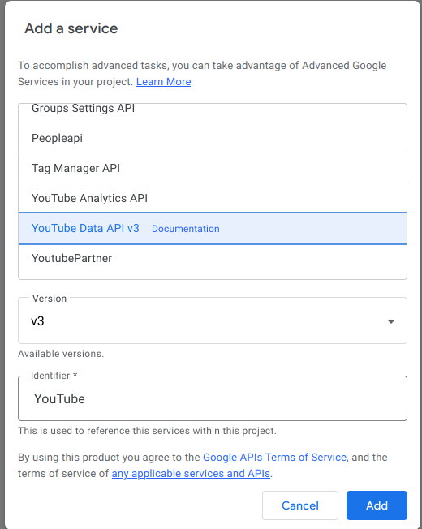

6. Hapus semua kode yang telah ada di dalam editor kode, kemudian salin kode dari [file berikut](./src/apps-script/main.gs) dan tempelkan isi file ke dalam editor kode. Anda dapat melihat kode sumbernya untuk memastikan bahwa skrip tersebut tidak melakukan hal yang buruk.

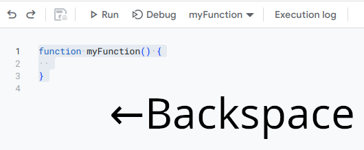

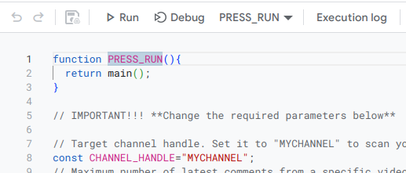

7. Simpan kode dengan meng-klik tombol "Simpan"

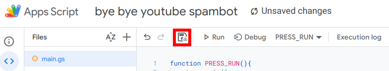

## Penggunaan

1. Buka Google Apps Script lalu klik project yang telah dibuat sebelumnya.

2. Jalankan kode dengan meng-klik tombol "Jalankan". Anda mungkin akan disuruh untuk memberikan otorisasi untuk skrip ini. Klik "Tinjau izin", lalu pilih akun Google yang terhubung ke channel anda. Ketika muncul peringatan "Google belum memverifikasi aplikasi ini", cukup klik pada teks "Lanjutan" pada pojok kiri bawah, kemudian klik "Buka [nama project] (tidak aman)". Akan muncul perintah untuk mengelola channel YouTube anda. Klik "Izinkan". Langkah ini hanya diperlukan sekali setelah melakukan instalasi.

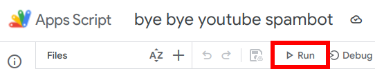

> [!TIP]
> Jika anda tidak dapat memberikan otorisasi, pastikan anda mengizinkan Cookie pihak ketiga di browser anda. Jika anda masih tidak dapat memberikan otorisasi, gunakan browser lain atau buat profil browser baru.

3. Lihat pada log eksekusi. Jika skrip telah berhasil mendeteksi komentar spam, maka hidupkan opsi untuk melakukan tindakan (menghapus) kepada komentar spam dengan cara menyetel variabel `ENABLE_TAKING_ACTIONS` ke `true` pada baris ke-16.

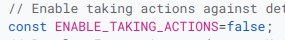

4. Jalankan ulang skrip untuk mulai melakukan tindakan pada komentar spam. Perlu diingat bahwa setelah langkah sebelumnya, skrip akan otomatis melakukan tindakan setelah memindai komentar kecuali jika variabel opsi untuk melakukan tindakan yang disebutkan diatas diatur kembali ke `false`.

5. Lihat kolom komentar pada video di channel anda jika komentar spam telah berhasil dihapus.

6. Untk memindai ulang, ulangi langkah pertama dan kedua, tetapi tanpa tahap otorisasi ulang.

> [!TIP]
> Anda dapat selalu melihat histori dari komentar apa saja yang dihapus oleh skrip ini dalam jangka waktu 7 hari terakhir dengan membuka tab "Eksekusi" di bawah ikon alarm pada bagian kiri, kemudian lihat tanggal dari eksekusi skrip dan lihat log eksekusi dengan meng-klik panah kebawah pada bagian kanan dari eksekusi yang dipilih.
> 
> 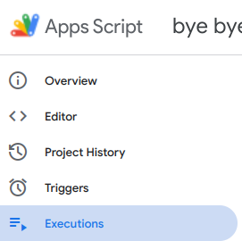
> 
> 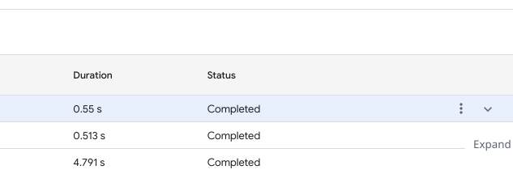
> 
> 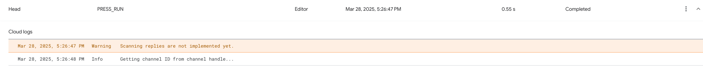

## Pemindaian otomatis

Anda dapat menjalankan skrip ini secara otomotatis untuk memindai dan melakukan tindakan kepada komentar spam secara berkala.

1. Klik ikon timer pada bagian kiri.

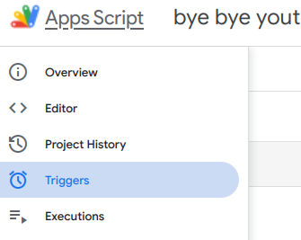

2. Klik tombol "Tambahkan pemicu" pada bagian kanan-bawah dari jendela browser anda.

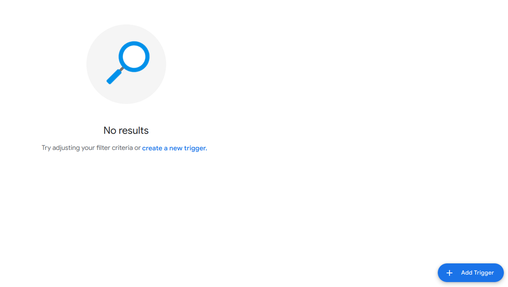

3. Ubah fungsi yang akan dijalankan ke `main`.

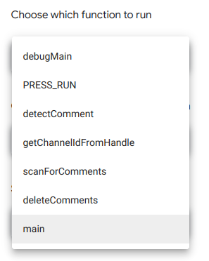

4. Ubah interval jam ke setiap 12 jam (direkomendasikan)

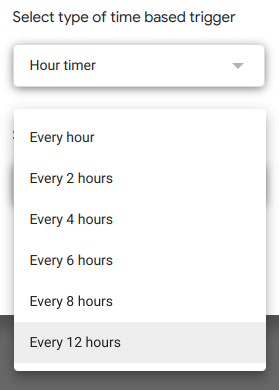

5. Klik "Simpan"

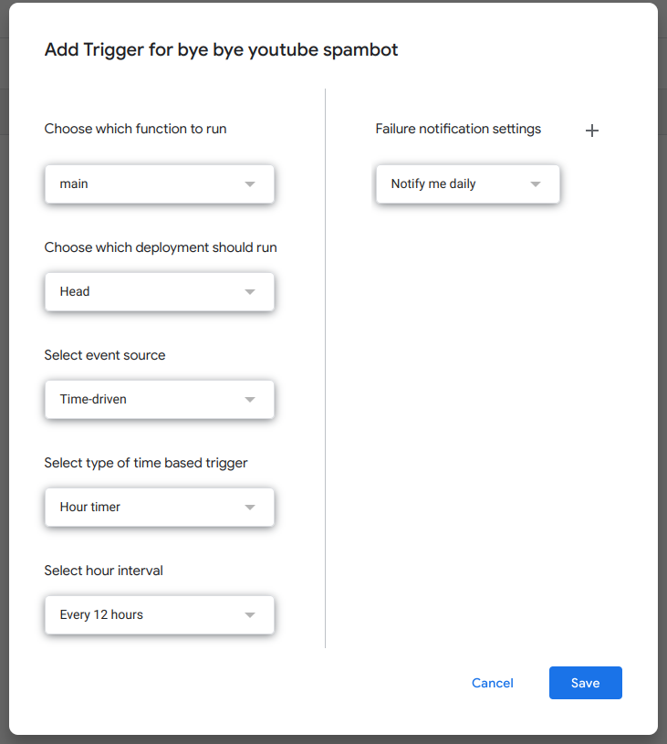

Anda dapat menghentikan skrip ini berjalan otomatis dengan menghapus pemicu yang anda buat dengan memilih pemicu yang sebelumnya anda buat, kemudian klik "Lainnya" (dengan ikon 3 titik secara vertikal), dan klik "Hapus pemicu"

## Penyesuaian

Anda dapat menyesuaikan perilaku skrip ini dengan mengubah variabel yang namanya menggunakan huruf kapital semua. Wajib diperhatikan bahwa mengubah jumlah maksimum komentar yang akan dipindah akan melebihi batas kuota harian yaitu 10.000. Untuk sekarang, anda dapat membaca dokumentasi selengkapnya di dalam file skrip itu sendiri.
