# YouTube Spam Comment Buster

#### Language

| English | [Indonesian](README.id.md) |
|-|-|

Blocks YouTube comments that contains special character that are likely to be spam using Google Apps Script.

## Setup

1. Open [Google Apps Script](https://script.google.com/home).

2. Create a new project.

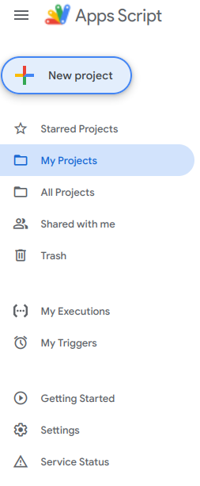

3. Rename it into whatever your like.

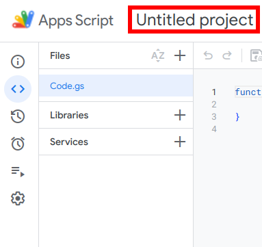

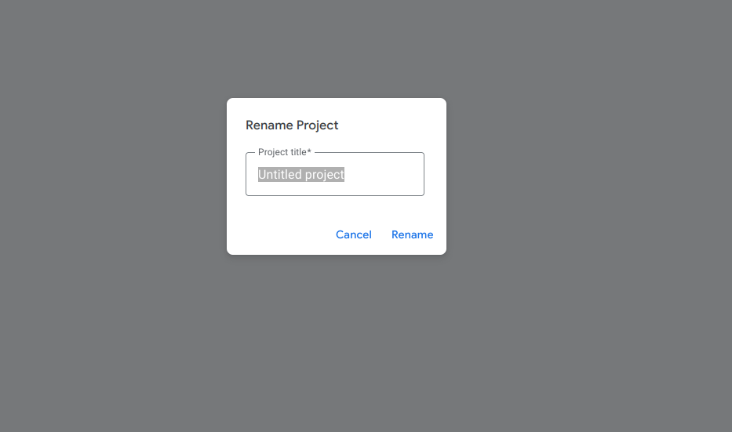

4. On the services section, click "Add" (+), scroll down and choose `YouTube Data API v3`.

5. Name the Identifier `YouTube` and press "Add"

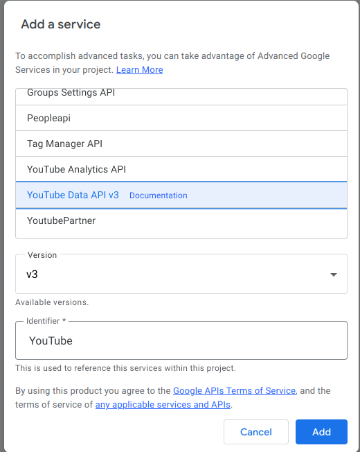

6. Delete every line of predefined code in the code editor. Then, copy the code from [this](./src/apps-script/main.gs) file and paste that into the code editor. You could take a look at the source code to make sure it is not doing anything bad.

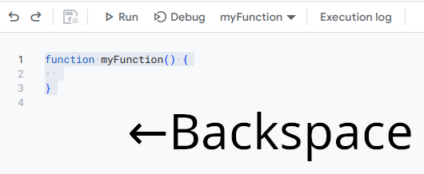

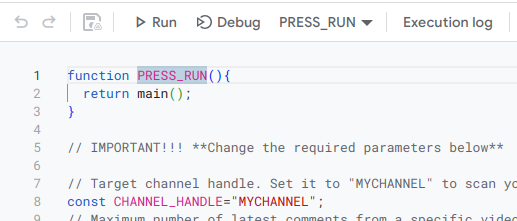

7. Press "Save" to save the code.

## Usage

1. Open Google Apps Script and click the relevant project that you created previously.

2. Press "Run". You might get a prompt to authorize this script. Click on "Review permissions". Select your Google Account that corresponds to your channel. If it shows the "Google hasn't verified this app" warning, just click on "Advanced" on the bottom-left corner, and click "Go to [your project name] (unsafe)". It will asks you to manage your YouTube account. Click "Allow". This is only required once after setting it up.

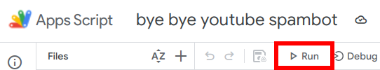

> [!NOTE]
> If you cannot authorize the app, make sure to allow third-party cookies, or use a different browser or browser profile.

3. Check on your channel's videos comment section if the spam comments are successfully deleted.

4. To rerun the scan, repeat step 1 and 2 again (but this time you don't have to authorize the script again)

> [!TIP]
> You can always take a look of the history of what this script is deleting in the last 7 days by opening the "Executions" tab just below the alarm icon on the left side, then lookup the date of the execution and expand the logs by pressing the down arrow on the right side of the highlighted run.
> 
> 
> 
> 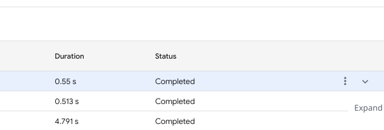
> 
> 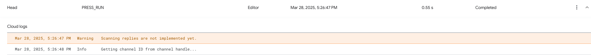
> 
> Also, you can set this script to only scan comments without taking any actions by setting the `ENABLE_TAKING_ACTIONS` variable to `false`
> 
> 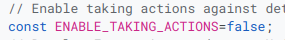

## Automation

You can run this script automatically to scan and take action of comments periodically.

1. Click the Timer icon on the left side.

2. Press "Add Trigger" button at the bottom-right side of your browser window.

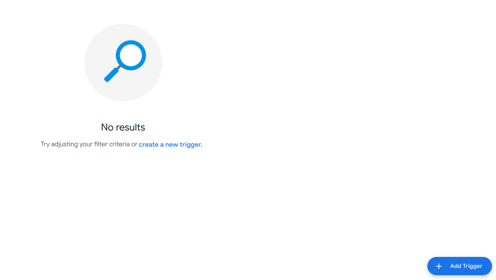

3. Change which function to run to `main`.

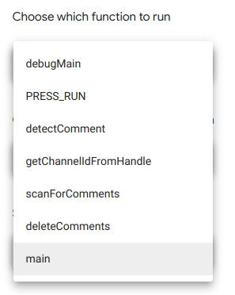

4. Change the hour interval into Every 12 hours (recommended).

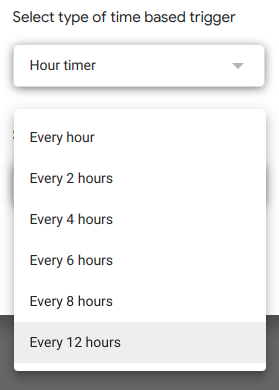

5. Press "Save"

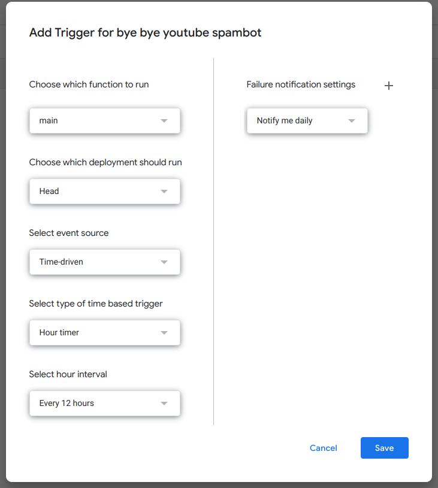

To stop this script from automatically running, delete the trigger that you created by highlighting the trigger that you previously created, then click on "More" (with vertical three dots icon), and click "Delete trigger"

## Customization

You can customize the behavior of the script by changing variables that are in all uppercase. Beware that changing the maximum amount of comments to be scanned may exceed your daily quota limit, which is 10,000. Currently, you can read additional documentation inside the script file itself.
